<div align="center">

<a href="brag-output-2026-09-27-015402/brag.mp4">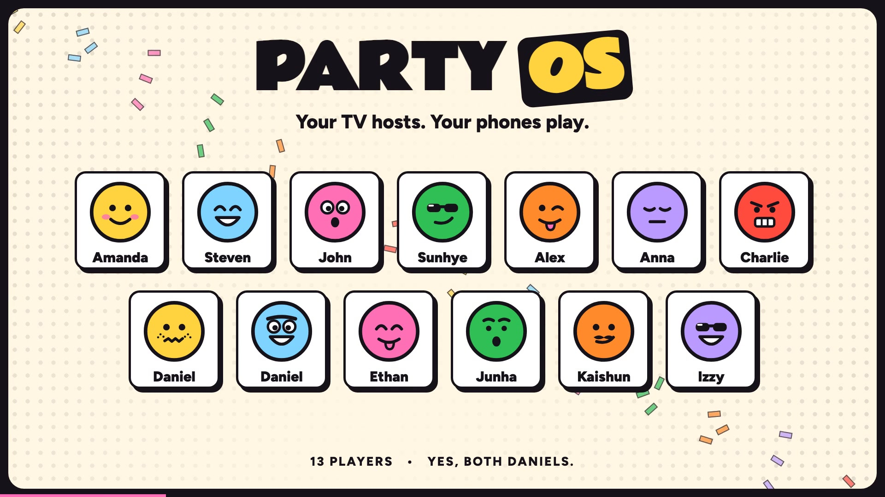</a>

# PARTY OS

**Your TV hosts game night. Phones are the controllers.**

A party game show for the living room, built for trivia night. The TV runs the show; up to 16 friends play in
teams from their phone's browser. No app, no account, one double-click.

[Watch the video](#13-friends-two-daniels-one-game-show) · [What’s new](#whats-new) · [Quick start](#quick-start) · [Brain Drain](#brain-drain-team-trivia-night) · [The other games](#the-other-games) · [How it's built](#how-its-built)

</div>

---

## 13 friends. Two Daniels. One game show.

**[▶ Watch the 24-second launch video](brag-output-2026-09-27-015402/brag.mp4)** — 1080p, with Party OS's own music,
an animated roll call, real Quick Draw reveals, a Heist and the new Write It Down round.

Starring **Amanda, Steven, John, Sunhye, Alex, Anna, Charlie, Daniel, Daniel, Ethan, Junha, Kaishun and Izzy**.
Both Daniels get their own face and player ID. The video uses staged demo data rendered through the current game
components; the names and results illustrate a party, rather than document a real match.

Made with [brag](https://github.com/latent-spaces/brag)'s lightweight `brag-slim` workflow.
[Poster](docs/media/party-os-crew-poster.jpg) · [Share caption](brag-output-2026-09-27-015402/share-copy.txt) ·
[Storyboard](brag-output-2026-09-27-015402/brag-plan.md)

## What's new

| Change | What it means on game night |
| --- | --- |
| **Pick up where you left off** | If the Mac restarts or the Terminal closes mid-party, double-click the launcher again: same room code, same scores, the game paused, and phones rejoin on their own. |
| **Selfies as faces** | Draw your face or snap a selfie or photo; the phone crops it and every screen shows it. Photos survive a restart too. |
| **Every game has its own look** | Drunk Blackjack is an after-hours casino, Bluff Battle a tabloid front page, Write It Down a pub quiz, Home Turf and Sprawl get their own boards. Brain Drain keeps the cartoon show. |
| **Timers: normal, relaxed, no rush** | Stretch every answer and decision timer 1.5× or 2× for a slower room (**R** on the TV or the captain's phone). Reveals keep their pace. |
| **Water tonight** | A switch on each phone at join and between games. Drink calls stay the same, but yours are worded as water. |
| **Phones stay awake** | Screens no longer dim and lock mid-question. |
| **Team-name veto** | The host can send a typed team name back to its default (**Esc** → Team names), and the team gets to name itself again. |
| **Sprawl** | The island-settling game on hexes named after the crew's places. Place settlements and roads on a mini-map on your phone, trade with anyone, and race to 8 points before the game clock runs out. |
| **Home Turf** | The property game on the crew's own places. Buy, auction, build and trade from your phone. A game clock ends it in 30 to 90 minutes, and the richest wins. |
| **Write It Down** | Type your team's answer with no multiple-choice hints. Close spelling counts. Play it inside Brain Drain or as its own pub quiz. |
| **A bigger question bank** | 302 multiple-choice questions, 62 Ballpark numbers and 23 Pick a Side sets. |
| **Questions remembered between nights** | The Mac launcher saves played questions, so the next party starts with fresh material. Exhausted packs recycle older questions on a later night. |
| **Live trivia when the pack runs low** | Optional Open Trivia DB questions extend Quick Draw and The Heist; the bundled game works offline. |
| **Shuffle and shout-outs** | Balance teams from the TV or captain's phone, then hand out awards based on how people played. |
| **The crew cut** | A new launch video featuring all 13 requested players, using the current game screens and soundtrack. |

## Quick start

You need a Mac plugged into a TV (HDMI or AirPlay), **Java 17**, **Node.js** and **Chrome**.

```bash
brew install openjdk@17 node          # once
```

Then double-click **`Start Party OS.command`** in this folder.

1. It builds everything, starts the party server and keeps the Mac awake.
2. The TV screen opens full screen in Chrome on the Mac's main display (so mirror the TV). If it shows **GO LIVE**,
   press **Enter** for sound.
3. Friends scan the QR code on the TV (same Wi-Fi), type a name and **draw their own face** (or snap a selfie).
4. The first person to join gets the **crown**: they pick the game and start it from their phone, so nobody has to
   get up. The TV keyboard works too.
5. To stop: press **Ctrl+C** in the Terminal window (or close it), and **Cmd+Q** closes the TV window.

**Restarted by accident?** Double-click the launcher again. Within six hours of the last move, the party comes back
as it was: same room code, players, teams, scores and photos, with the game paused until the host carries on.
Phones reconnect by themselves. To start a brand-new party instead:

```bash
PARTYOS_FRESH=1 ./"Start Party OS.command"
```

The party lives in `~/Library/Application Support/PartyOS/party.json` and photo faces in `.../PartyOS/photos`.

If something's off:

- **Phones can't join:** they must be on the same Wi-Fi as the Mac, and guest networks usually block this. If macOS
  asks whether `java` may accept incoming connections, click **Allow**.
- **TV window on the wrong screen:** System Settings → Displays → mirror the TV. **No sound on the TV:** System
  Settings → Sound → Output → the TV, and check PARTY OS isn't muted (**M** toggles it).
- **"Port 8080 is already in use":** PARTY OS is already running in another Terminal window. Close that one first.
- **Host PIN:** printed in the Terminal window. Open `/host` on your phone and enter it to pause, skip or remove
  players without the Mac's keyboard.

No friends yet? Rehearse with bots that join, team up, argue and vote like people do:

```bash
node controller/scripts/bots.mjs 12
```

| On the TV | Does |
| --- | --- |
| ← → · Enter | pick a game · start it |
| ↑ ↓ | questions per round (Brain Drain) or rounds (3–8) |
| T · D | Brain Drain teams (auto, 2–6) · drink calls on/off |
| R | timers: normal, relaxed (1.5×) or no rush (2×) |
| Esc | host controls: pause, skip ahead, end, remove players, give the crown, reset team names, phone control on/off, volume, Spotify |
| N | next song (when Spotify is playing) |
| P · M · F | pause · mute · full screen |

<p align="center">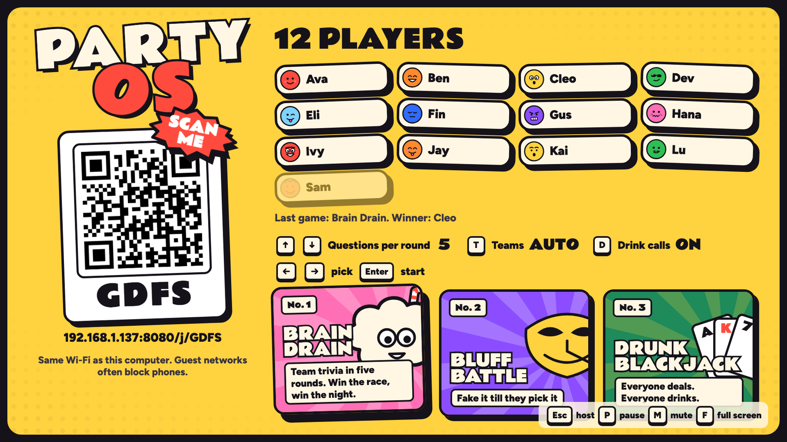</p>

## Brain Drain: team trivia night

Teams vote on their phones. **The team's answer is whatever most of them pick**, so the fun is arguing out loud
before the buzzer. Five rounds, five different formats, dealt in a new order every show, one host: Brainy, a pink brain sipping through a bendy straw.

| Round | How it works |
| --- | --- |
| **Quick Draw** | Four answers with a colour *and* a shape (Kahoot-style, readable from the couch). Right answers score 1,000, plus up to 500 for speed. |
| **Ballpark** | Guess a number on a keypad. Your team's guess is the median of everyone's. Closest team wins; within 1% is a **bullseye**. |
| **Pick a Side** | Seven rapid calls, five seconds each: *Pokémon or medication? Font or cheese? IKEA or Middle-earth?* |
| **The Heist** | Right answers win 500. The fastest correct team votes on which team to rob. |
| **Write It Down** | No options on screen: type the answer. Your team's most-written answer counts, and close spelling is fine ("Seatle", "da Vinci", "the river Seine"), but numbers must be exact and "red or blue" never counts. |

<p align="center">
  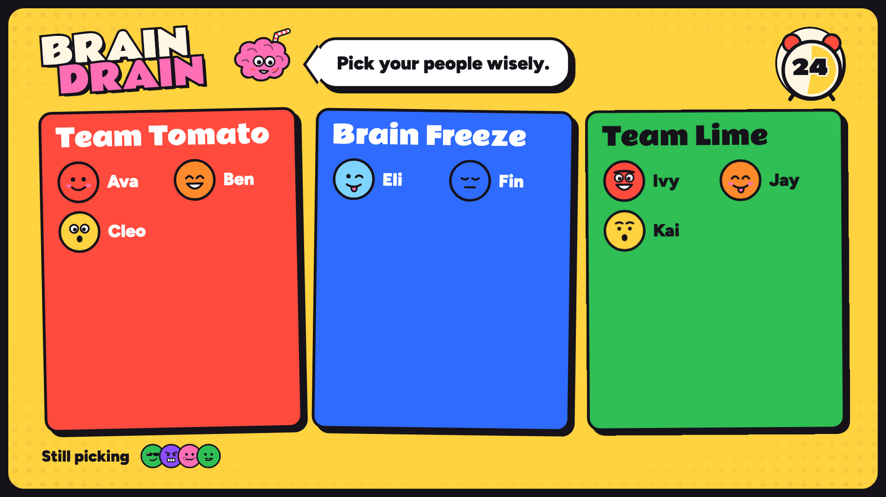
  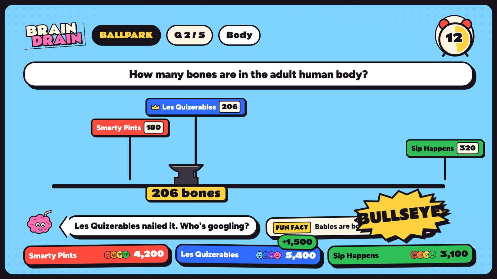
  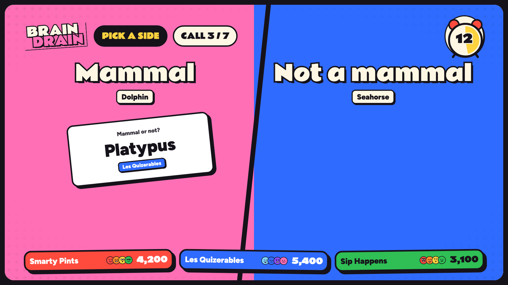
  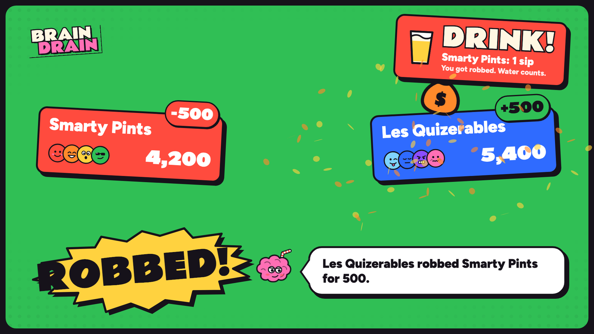
  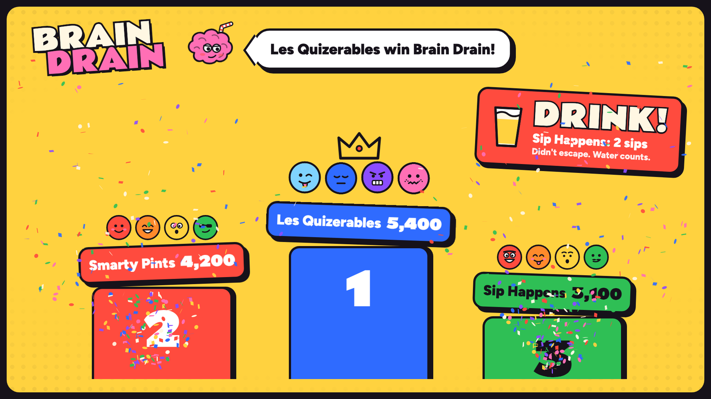
</p>

- **Drink calls** (on by default, **D** turns them off): last place after each round drinks a sip, a Heist victim
  drinks a sip, and the last-place team at the end drinks two. Water counts. The most points wins; The Heist never opens a show.
- Teams carry over to the next show. Late arrivals join the smallest team at the next question.
- **Shuffle:** friends always pile onto one team. During Team Up, press **S** on the TV (or tap "Shuffle evenly"
  on the captain's phone) to deal everyone evenly across the teams; names stay, everyone checks their new team.
- **Awards:** after the podium, up to four shout-outs from how each person actually played: Big Brain, Fastest
  Thumb, Lone Wolf (went against their team and was right), Human Calculator, and roasts like Contrarian, Dead
  Weight and Ghost. Winners see theirs on their phone.
- 302 multiple-choice questions, 62 Ballpark numbers, 23 Pick a Side sets, all original,
  every one with a fun fact or a checkable answer. That's enough for about 20 full shows without a repeat, and
  Pick a Side deals its calls in a new order every show.
- **No repeats:** every question played is remembered in `~/Library/Application Support/PartyOS/played-questions.json`,
  so later shows and later nights skip it. Nothing played tonight comes back tonight; once a pack is used up on a
  later night, the questions played longest ago return. Delete that file to replay everything.
- **Live fallback:** once the bundled multiple-choice questions run low, the server quietly fetches more from
  [Open Trivia DB](https://opentdb.com) (easy and medium only, anything too long for the TV dropped) and uses them
  for Quick Draw and The Heist after the bundled ones are gone. Live questions have no fun fact and show a small
  "from Open Trivia DB · CC BY-SA 4.0" credit. With no internet the round just ends early; `--live-trivia off` on
  the devserver keeps a show fully offline.
- A show runs about 15–20 minutes at the default five questions per round.

## Your phone is the controller

<p align="center">
  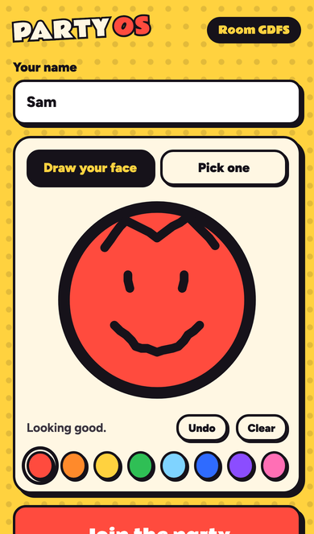
  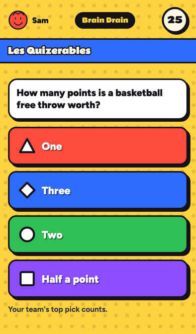
  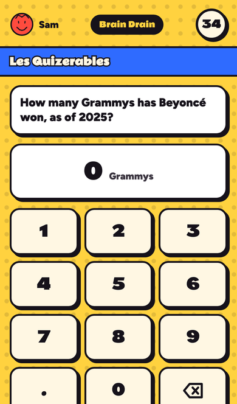
  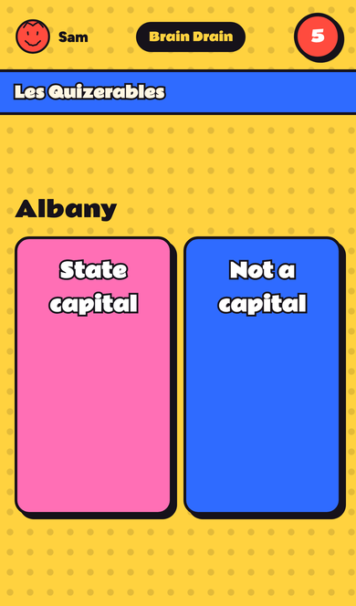
  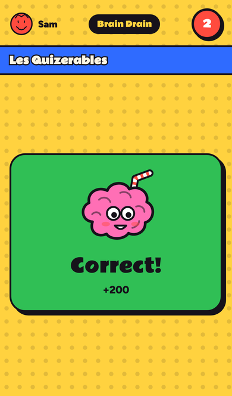
</p>

**The captain.** Whoever joins first holds the crown (Jackbox calls this the VIP). Their phone picks the game, sets
questions per round, teams and drink calls, and starts the show; during a game a crown button opens pause, skip
ahead and end. The TV mirrors every choice. If their phone drops, the crown moves to the next person who joined and
comes back when they do; they can pass it on, and the TV's host controls can hand it to anyone or switch phone
control off. Removing players stays on the TV.

Scan, type a name, draw a face (or take a selfie), play. Flip **Water tonight** on and your drink calls are
worded as water; the screen stays awake while a game runs. Buttons are thumb-sized, every choice is colour **and** shape **and** text,
teammates' faces show up on the answer they picked, and phones buzz on every tap and on your team's result. A
refreshed or dropped phone rejoins as the same player.

## The other games

**Write It Down.** Brain Drain's typed-answer round as a game of its own: a pub quiz in three rounds. No options on
screen, everyone types the answer, and the team's most-written answer counts (close spelling is fine). Same teams,
settings, standings, drink calls and awards as Brain Drain.

**Answer & Question.** A Jeopardy-style quiz show. Five categories, five clues each, and whoever last answered right picks the next square from their own phone (the captain can always pick too). Read the clue, wait for the BUZZ button to light up (buzz early and you are locked out for a second), then type your answer; a wrong answer costs the clue's value and reopens the buzzers to everyone else. Watch for Daily Doubles, and finish with a secret-wager Final Jeopardy. In the lobby, choose a **Short** show (one board plus Final Jeopardy) or a **Full** one (with Double Jeopardy), press D for drink calls, and set the answer timers like any other game.

**Bluff Battle.** Everyone gets a weird-but-true question and writes a fake answer. Then everyone hunts for the
truth among the fakes. Fool a friend for points; find the truth for more.

**Drunk Blackjack.** The dealer rotates round the room. Everyone else bets sips or a shot against this hand's
dealer, and the dealer plays their own hand from their phone. If the dealer busts, they drink every bet on the table.

**Home Turf.** Buy your friends' places and charge them rent, with the real property-game rules sped up for a party:

- **Turns:** roll on your phone. Buy what you land on, or pass it to a live auction on every phone, where each bid
  resets the clock. The speed die kicks in once you've passed Payday.
- **Sets, hotels and trades:** a full colour set doubles the rent, three houses make a hotel, and trades (places,
  cash and Get Out cards) are built, countered and accepted on the phones while the TV shows the deal.
- **Solo or teams:** play solo up to 6, or in teams with a rotating dice-holder.
- **The clock:** when it runs out, everyone finishes the lap and the richest wins (cash, plus places at their price,
  plus buildings at cost).
- **Drinks:** rent, Timeout and bankruptcy come with drink calls; the lobby can switch them off.
- **Controls:** on the TV lobby, ↑/↓ sets the game clock, T switches between Auto, Solo and Teams, and S switches the
  TV show between Theatre and Quick.
- **In 3D:** on the TV the board is a lit wooden tabletop with drink pieces (soju, vodka, beer bottle, beer can, shot
  glass, red cup) on coloured coasters. In Theatre, a rolled move gets two real tumbling dice that always show the game's numbers, and a slowed, close-up finish; landings get their own moments (rent coins, a tax burst, a Payday rain, a card flip, a cage for Timeout, a bankrupt drink tipping off the table, houses that pop in, and a deed floating over a place on offer);
  Quick keeps the short move. Space or Enter skips the animation in progress. Add `?quality=low` to the TV address on a
  slow machine, or `?board=2d` for the flat board. Close spare browser tabs: two 3D pages share one GPU.

<p align="center">
  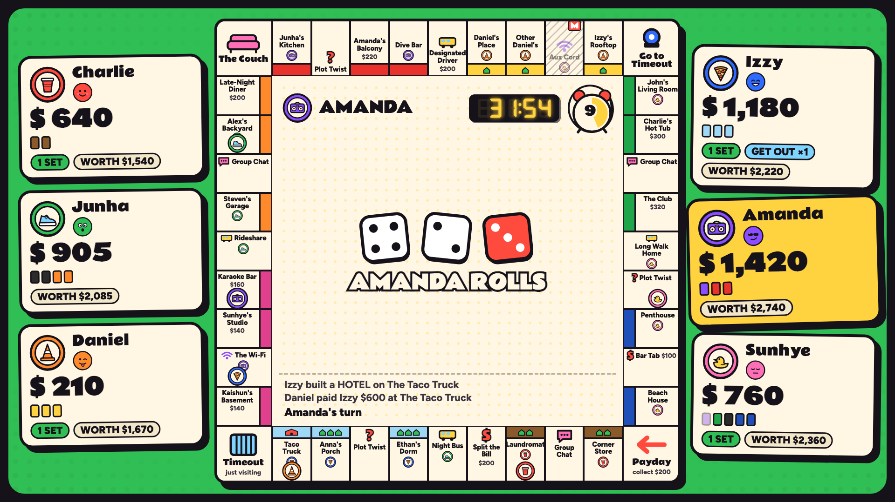
  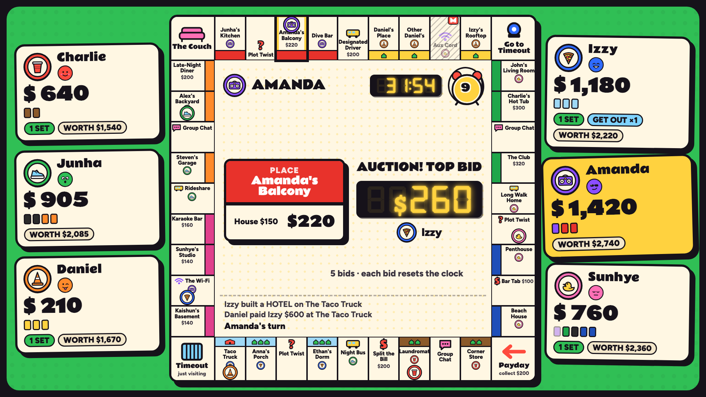
</p>

**Imposter.** Everyone gets a secret card, except the imposter, who only sees the category. Hold your card to peek (it hides
the moment you let go), type one word that proves you know the word without giving it away, then argue it out and vote on
your phone. Name the imposter for points; the imposter scores for staying hidden, or for guessing the word once caught.
Four to sixteen players (two imposters from nine), five rounds by default, the last one counts double. The vote comes with
drink calls, and the lobby switch and Water tonight work as in the other games.

**Doodle Dash.** Pictionary-style: one player at a time gets a word (pick easy, medium or hard) and draws it on their phone while
the TV shows every stroke live, on a big easel. Everyone else types guesses on their phones; wrong guesses float across the TV
as speech bubbles, a "so close!" is private, and hint letters appear as the clock runs down. Quick guessers score more, harder
words score more, and the drawer scores when others get it. Everyone draws (five turns by default, the last counts double), then
the TV replays each drawing as a time-lapse and hangs the whole night's drawings in a gallery. Three to sixteen players. Strokes
travel over their own socket message (not game state), so drawing never slows the other phones.

### Rename the board

The spaces are named after the crew's places. To rename them, edit
[`tv/engine/src/main/resources/turf/board.json`](tv/engine/src/main/resources/turf/board.json):

- **What you can change:** each space has a `name` (≤ 24 characters) and a TV `label` (≤ 22). The deck names and the
  card text are in the same file, and `{space:N}` in a card is replaced by that space's name.
- **What stays fixed:** prices and rents are the standard values, keyed by board position in `TurfBoard.kt`, so a
  rename can't break the economy.
- **Applying edits:** the launcher rebuilds on every start. A test checks the file (40 spaces, lengths,
  placeholders) if you run `./gradlew :engine:test`.

**Sprawl.** The island-settling classic at party speed, on hexes named after the crew's places:

- **The island:** a new balanced layout every game (no 6s or 8s side by side). It has 19 hexes for 3–4 players and
  30 for 5–6, with harbours round the coast.
- **Your phone:** your hand as five big tiles. Place settlements, roads and cities by tapping a glowing spot on the
  mini-map, then confirm; the TV rings the spot you're eyeing so the room can heckle.
- **Rolls:** a 7 means big hands discard half, then The Landlord moves in and robs someone. Development cards are
  Bouncers (move The Landlord), Road Trip, Windfall, Shakedown and secret points.
- **Trades:** offer a deal to one player or to anyone; they accept, reject or counter on their phones. Trade with the
  bank at 4:1, or better at your harbours.
- **The clock:** first to 8 points wins on their turn (the lobby can switch it to 10). When the game clock runs out,
  everyone gets one last turn and the most points wins.
- **Drinks:** getting robbed, discarding, losing Longest Road or Most Bouncers, and someone else's city come with
  drink calls.
- **Controls:** on the TV lobby, ↑/↓ sets the game clock, V switches between 8 and 10 points, and D turns drink calls
  on or off.

<p align="center">
  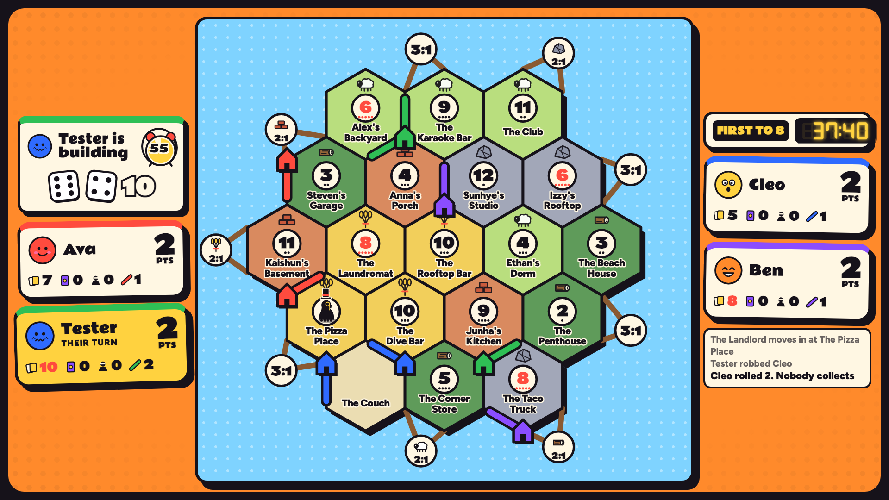
</p>

To rename the island, edit [`tv/engine/src/main/resources/sprawl/board.json`](tv/engine/src/main/resources/sprawl/board.json):
the place names (dealt onto the hexes at random), the two desert names, The Landlord, the resources and the card and
award names. A test checks it when you run `./gradlew :engine:test`.

<p align="center">
  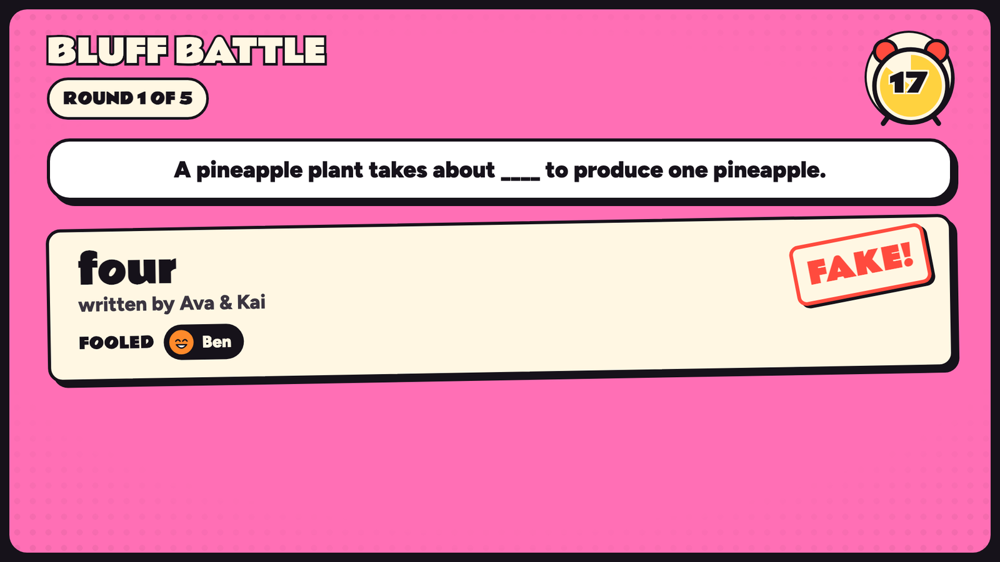
  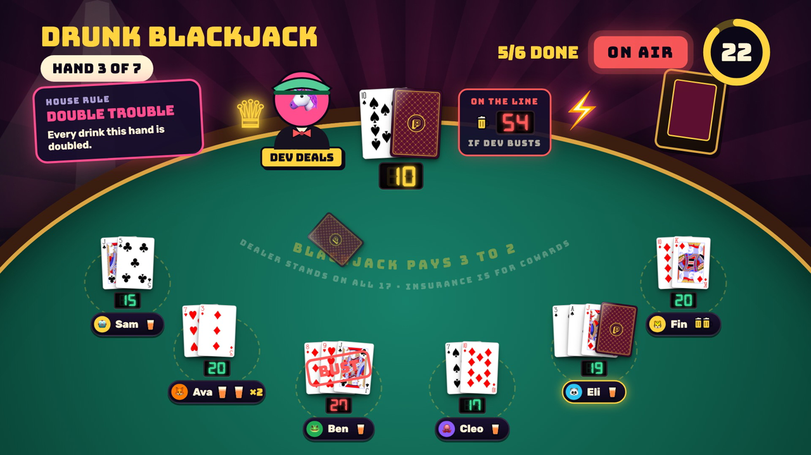
</p>

## The look and the sound

- **Saturday Morning:** thick ink outlines, flat loud colour, halftone dots, comic bursts, hand-drawn faces instead
  of emoji. One token file ([`controller/src/theme/tokens.css`](controller/src/theme/tokens.css)) drives the TV
  and the phones. Fonts: Rammetto One for display, Figtree for reading.
- **A room for each game:** the other games dress up on the TV and the phones alike. Drunk Blackjack plays in a dark
  casino (emerald felt, mahogany rail, brass signs), Bluff Battle is a tabloid front page, Write It Down on its own is
  a pub quiz with answer sheets, and Home Turf and Sprawl have their own boards. The themes live in
  [`controller/src/theme/games.css`](controller/src/theme/games.css); `/tv?gallery=themes&game=blackjack` (or `bluff`,
  `writeitdown`, `turf`, `sprawl`; add `&view=phone` for the phone) shows them from fixtures.
- **Spotify instead:** with the Spotify app on the Mac, press **Esc** on the TV → **Music** → **Spotify**. The score
  goes quiet, Spotify starts playing (pick a playlist in Spotify first), the effects still play over it, and **N**
  skips a song. The first time, macOS asks whether `java` may control Spotify: click **OK**.
- **Music:** a composed cartoon big band score (120 BPM, F major) with a loop per round, a hurry-up bed for the last
  ten seconds and stingers that duck the music. Generate it once with ElevenLabs:

  ```bash
  export ELEVENLABS_API_KEY=...                    # ElevenLabs → Developers → API keys
  node controller/scripts/audio/generate.mjs       # writes controller/public/assets/audio
  ```

  The cue list lives in [`controller/scripts/audio/cues.json`](controller/scripts/audio/cues.json); re-roll any cue
  with `--only <id> --force`. Until the score exists, music stays silent and effects fall back to small synthesized
  versions.

## How it's built

```
tv/engine      Kotlin: the games and the party rules (one engine, used by every screen)
tv/server      Ktor: join, host PIN, WebSocket protocol
tv/devserver   runs engine + server on a Mac: this is what Start Party OS.command launches
tv/app         Android TV app (Jetpack Compose) running the same engine on the TV itself
controller/    React + Vite: the phone controller and the web TV screen (/tv)
```

- Brain Drain is [`tv/engine/.../games/trivia/BrainDrain.kt`](tv/engine/src/main/kotlin/partyos/engine/games/trivia/BrainDrain.kt);
  its questions are the `trivia-*.json` packs next to it in `src/main/resources/packs`.
- The web TV draws on a fixed 1920×1080 stage scaled to any screen, with [Motion](https://motion.dev) for animation.
  Phones and the TV both render snapshots from the engine; the server owns every timer, vote and score.
- **Android TV:** the same engine runs natively in `tv/app`; its screens still use the 1.0 look.

### Develop

```bash
cd tv && ./gradlew :devserver:installDist && devserver/build/install/devserver/bin/devserver --pin 1234 --static ../controller/dist
# optional: --party party.json (resume after a restart) --photos photos/ (keep photo faces) --played played.json
cd controller && npm run dev              # live reload; proxies /api and /ws to the devserver
```

Open `http://localhost:5173/tv` for the TV and `/j/ROOM` for a phone. `/tv?gallery=trivia` renders every Brain Drain
beat from fixtures, and `node controller/scripts/shots.mjs` screenshots them all at 1920×1080.

```bash
cd tv && ./gradlew :engine:test :server:test :app:testDebugUnitTest   # engine, server and TV layout tests
cd controller && npm test && npm run e2e                                # protocol tests + phone flows in Playwright
```

Design notes and every game's beat sheet are in [`docs/party-os/show-bible.md`](docs/party-os/show-bible.md).

## Credits

Fonts: [Rammetto One](https://fonts.google.com/specimen/Rammetto+One), [Figtree](https://github.com/erikdkennedy/figtree),
[DSEG7](https://github.com/keshikan/DSEG) (all OFL). Cards: [Adrian Kennard](https://www.me.uk/cards/) via
[@letele/playing-cards](https://github.com/letele/playing-cards) (CC0). Round formats nod to *Buzz!*, *You Don't Know
Jack*, *Wits & Wagers* and *Trivia Murder Party*; the names, art and questions are original.

Please drink responsibly. Sips of water count.
