<div align="center">

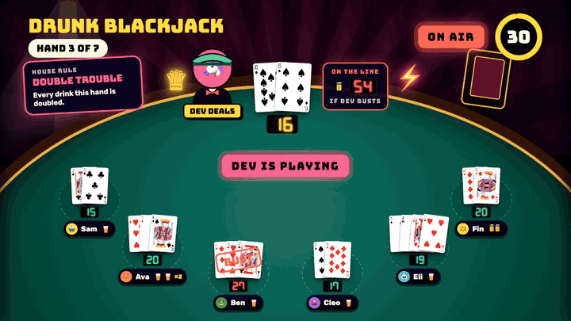

# PARTY OS

**Your TV hosts game night. Phones are the controllers.**

A Jackbox-style party game show for the living room. The TV runs the show; up to 16 friends play from their
phone's browser. No app, no account, one double-click.

[▶ Watch the 20-second launch video](docs/media/party-os-launch.mp4) · [Quick start](#quick-start) · [The games](#the-games) · [How it's built](#how-its-built)

</div>

---

## Quick start

You need a Mac plugged into a TV (HDMI or AirPlay), **Java 17**, **Node.js** and **Chrome**.

```bash
brew install openjdk@17 node          # once
```

Then double-click **`Start Party OS.command`** in this folder.

1. It builds everything, starts the party server and keeps the Mac awake.
2. The TV screen opens full screen in Chrome, with sound.
3. Friends scan the QR code on the TV (same Wi-Fi) and pick a name and an avatar.
4. Pick a game with **← →** and press **Enter**.

No friends yet? Rehearse with bots that join, bluff, bet and deal like people do:

```bash
node controller/scripts/bots.mjs 6
```

| On the TV | Does |
| --- | --- |
| ← → · Enter | pick a game · start it |
| ↑ ↓ | number of rounds |
| Esc | host controls: pause, skip, end, remove players, sound and music volume |
| P · M · F | pause · mute · full screen |

<p align="center"></p>

## The games

### 🃏 Drunk Blackjack: everyone deals, everyone drinks

The dealer rotates round the room. Everyone else bets **sips or a shot** against this hand's dealer, plays their
hand from their phone, and then the dealer plays theirs, live, from *their* phone. They must hit under 17.

**If the dealer busts, they drink every bet on the table.**

<p align="center">
  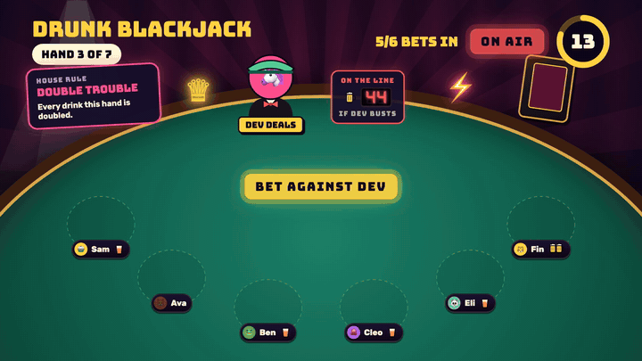
  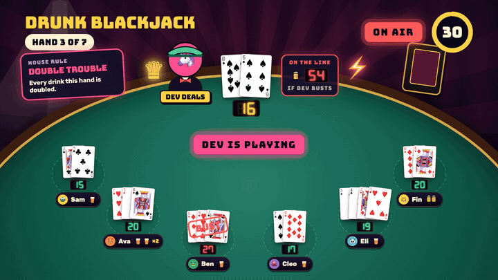
</p>

- Beat the dealer and they drink your bet; lose or bust and you drink it. Blackjack makes the dealer drink double.
- Doubling down doubles the drinks. **ON THE LINE** shows what the dealer is sweating.
- A House Rule each hand (Double Trouble, Lucky Sevens). The podium ranks who made the most people drink.
- A classic deck with Goodall court figures, 3D flips and a dealer who wears your avatar and a green visor.

### 🎭 Bluff Battle: lie to your friends

Everyone gets a weird-but-true question and writes a fake answer. Then everyone hunts for the truth among the fakes.
Fool a friend for points; find the truth for more.

<p align="center">
  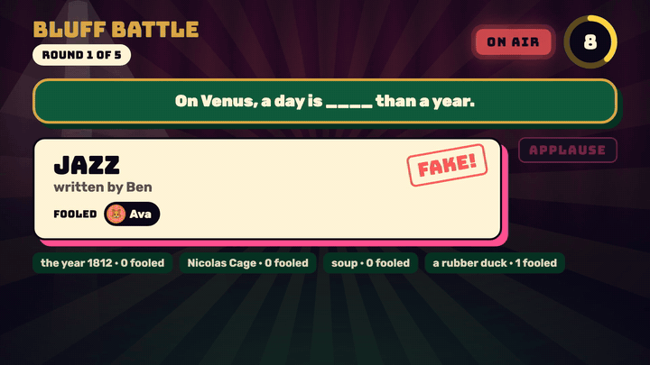
  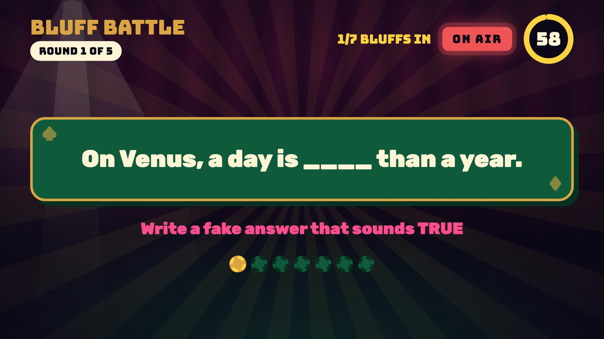
</p>

## Your phone is the controller

<p align="center">
  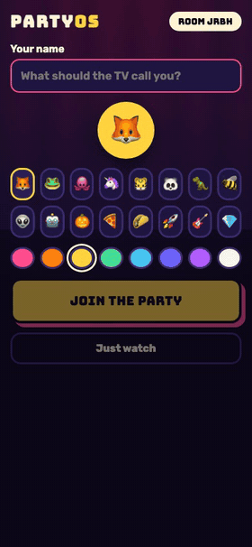
  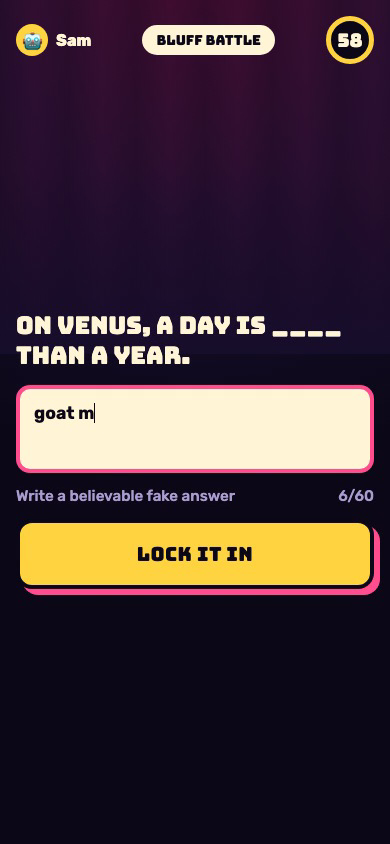
  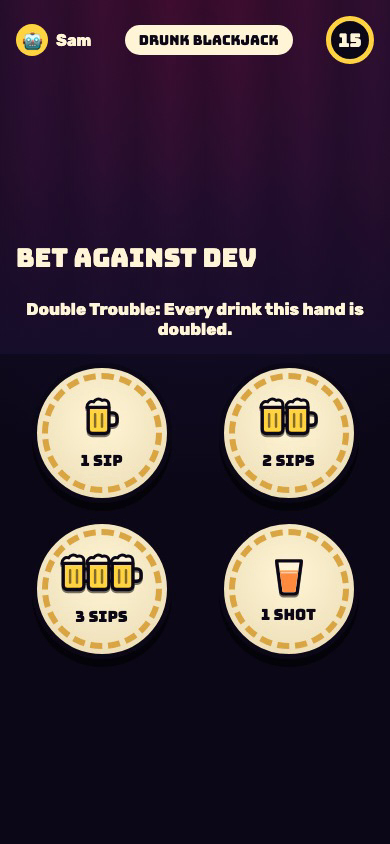
  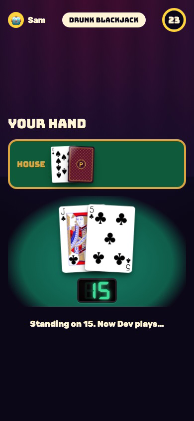
  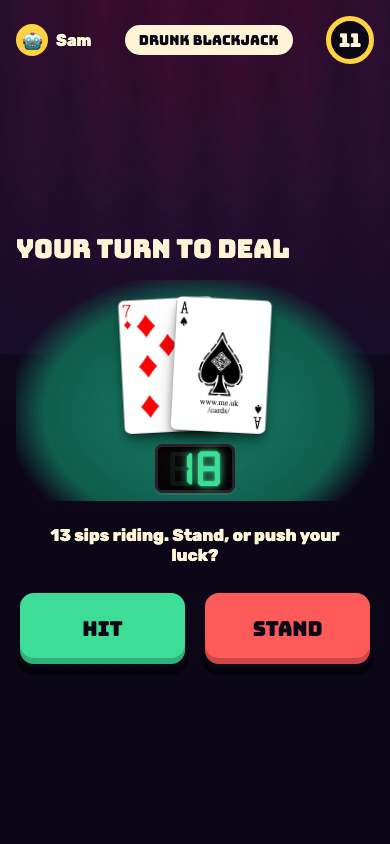
</p>

Scan, type a name, play. A refreshed or dropped phone rejoins as the same player; latecomers join at the next round.

## The show

It's a late-night game show, not a web page:

- **The studio:** velvet curtains, swaying spotlights, a slow sunburst, marquee bulbs that chase, an ON AIR sign, and
  an APPLAUSE sign that lights up for the truth.
- **The house band:** every sound is synthesized live in the browser: a lounge band that changes with each phase
  and hurries in the last 10 seconds, plus chip clacks that climb as bets come in, card flicks, drumrolls, a sad
  trombone, a studio audience that goes "ooooh", and applause. No audio files.
- **Motion:** props slam, pop and deal onto the stage; cards fly along arcs and flip in 3D; scores count up.

<p align="center">
  
  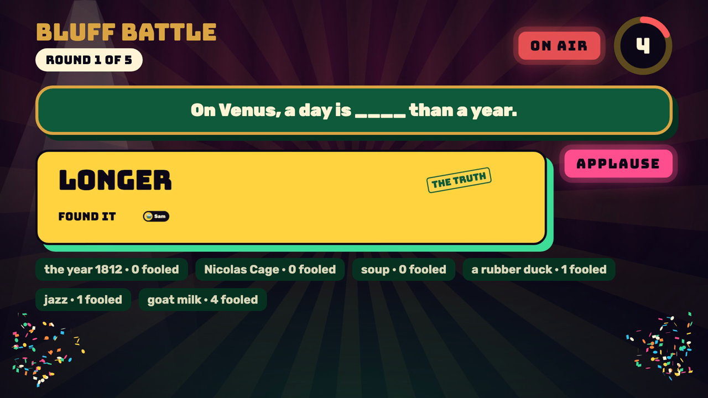
</p>

## How it's built

```
tv/engine      Kotlin: the games and the party rules (one engine, used by every screen)
tv/server      Ktor: join, host PIN, WebSocket protocol
tv/devserver   runs engine + server on a Mac: this is what Start Party OS.command launches
tv/app         Android TV app (Jetpack Compose) running the same engine on the TV itself
controller/    React + Vite: the phone controller and the web TV screen (/tv)
```

- The web TV (`controller/src/tv/`) draws on a fixed 1920×1080 stage scaled to any screen. It uses
  [Motion](https://motion.dev) and [GSAP](https://gsap.com) for animation, canvas-confetti, Web Audio for all sound,
  and [@letele/playing-cards](https://github.com/letele/playing-cards) (Adrian Kennard's CC0 deck) for the cards.
- Phones and the TV both render snapshots from the engine; the server owns every timer and score.
- **Android TV:** the same games render natively in `tv/app`. See [`docs/party-os/`](docs/party-os/).

### Develop

```bash
cd tv && ./gradlew :devserver:installDist && devserver/build/install/devserver/bin/devserver --pin 1234 --static ../controller/dist
cd controller && npm run dev              # live reload; proxies /api and /ws to the devserver
```

Open `http://localhost:5173/tv` for the TV and `/j/ROOM` for a phone. Add `?gallery` to `/tv` to see every card.

```bash
cd tv && ./gradlew :engine:test :server:test :app:testDebugUnitTest   # engine, server and TV layout tests
cd controller && npm test && npm run e2e                                # protocol tests + phone flows in Playwright
```

Design notes, the sound palette and every game's beat sheet are in [`docs/party-os/show-bible.md`](docs/party-os/show-bible.md).

## Credits

Fonts: [Bungee and Bungee Shade](https://github.com/djrrb/Bungee), [Rubik](https://github.com/googlefonts/rubik),
[DSEG7](https://github.com/keshikan/DSEG) (all OFL). Cards: [Adrian Kennard](https://www.me.uk/cards/) via
[@letele/playing-cards](https://github.com/letele/playing-cards) (CC0). Drunk Blackjack's casino energy is a love
letter to *Gamble With Your Friends*. Launch video made with [/brag](https://github.com/latent-spaces/brag).

Please drink responsibly. Sips of water count.

---

<details>
<summary><b>The original HoopDreams</b>: game night, the shot tracker and the random game hat</summary>

A TV party arcade for four teams of four: live team trivia, phone-to-TV drawing, funny-answer voting, and the shot tracker.

**Quick start on Mac:** double-click `Start Game Night.command`. On the host page, choose **Set up four teams**, invite everyone with the TV QR code, and start a game. No API account required. See [the game-night guide](docs/game-night.md). The original random game hat is at `/hat`.

### Stack

- **Frontend**: React + TypeScript (Vite)
- **Backend**: Python (FastAPI)
- **Database**: SQLite (via SQLAlchemy)

### Running locally

#### Backend

```bash
cd backend
python3 -m venv venv
venv/bin/pip install -r requirements.txt
venv/bin/uvicorn app.main:app --reload --port 8000
```

This seeds the game list on first run and creates `backend/hoopdreams.db`.

#### Frontend

```bash
cd frontend
npm install
npm run dev -- --port 5180
```

Open the printed URL (defaults to `http://localhost:5180`). Live party traffic uses the Vite proxy to port 8000. The original `/hat` page expects the API at `http://localhost:8000` (see `frontend/.env`).

### How it works

- The hat holds every active game from the `games` table.
- Tapping the hat draws a random game that hasn't come up yet this round (`POST /api/draw`), logs it to the `draws` table, and shows it as a card.
- Once every game has been drawn, the next tap reshuffles the hat automatically.
- "Recently drawn" pulls the last few draws from `GET /api/history`.
- Add or edit games directly in `backend/app/seed_data.py` (only used to seed an empty database) or the `games` table.

### Party mode (shot tracker)

Run it on the MacBook that is plugged into the TV:

```bash
backend/venv/bin/python backend/scripts/party.py            # add --tunnel for guests on cell data
```

This builds the frontend, serves everything on port 8000 and keeps the Mac awake. It prints a QR code and a host PIN, then opens the TV page in Chrome.

- **TV**: `http://localhost:8000/tv`. Mirror the Mac onto the TV and choose **Full screen**. The original arcade shot board is at `/tracker`.
- **Phones**: scan the QR code on the TV (same Wi-Fi), or the "not on Wi-Fi?" code when `--tunnel` is on.
- **Host panel**: `http://localhost:8000/host` with the printed PIN (set `HOOP_HOST_PIN` to choose one).
- **Rehearsal**: add `--demo` for 16 simulated guests in a separate temporary night.

Development: run the backend as above, then `npm run dev -- --host` in `frontend/`. Open `/tv`, `/play` or `/host` on the Vite port, and set `HOOP_PUBLIC_PORT=5173` for the backend so the TV's QR code points at Vite.
Tests: `cd backend && venv/bin/python -m pytest` and `cd frontend && npm test`.

</details>
