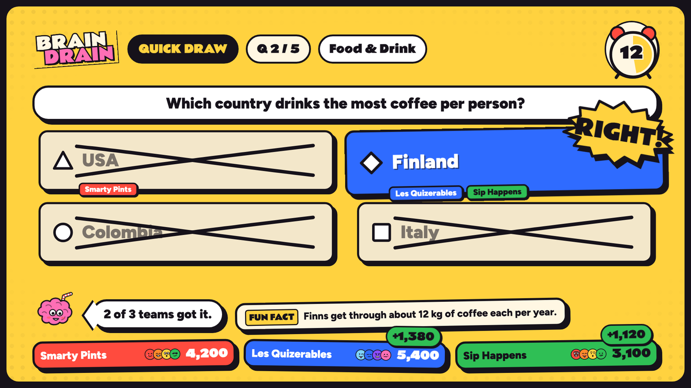

<div align="center">



# PARTY OS

**Your TV hosts game night. Phones are the controllers.**

A party game show for the living room, built for trivia night. The TV runs the show; up to 16 friends play in
teams from their phone's browser. No app, no account, one double-click.

[Quick start](#quick-start) · [Brain Drain](#brain-drain-team-trivia-night) · [The other games](#the-other-games) · [How it's built](#how-its-built)

</div>

---

## Quick start

You need a Mac plugged into a TV (HDMI or AirPlay), **Java 17**, **Node.js** and **Chrome**.

```bash
brew install openjdk@17 node          # once
```

Then double-click **`Start Party OS.command`** in this folder.

1. It builds everything, starts the party server and keeps the Mac awake.
2. The TV screen opens full screen in Chrome on the Mac's main display (so mirror the TV). If it shows **GO LIVE**,
   press **Enter** for sound.
3. Friends scan the QR code on the TV (same Wi-Fi), type a name and **draw their own face**.
4. The first person to join gets the **crown**: they pick the game and start it from their phone, so nobody has to
   get up. The TV keyboard works too.
5. To stop: press **Ctrl+C** in the Terminal window (or close it), and **Cmd+Q** closes the TV window.

If something's off:

- **Phones can't join:** they must be on the same Wi-Fi as the Mac, and guest networks usually block this. If macOS
  asks whether `java` may accept incoming connections, click **Allow**.
- **TV window on the wrong screen:** System Settings → Displays → mirror the TV. **No sound on the TV:** System
  Settings → Sound → Output → the TV, and check PARTY OS isn't muted (**M** toggles it).
- **"Port 8080 is already in use":** PARTY OS is already running in another Terminal window. Close that one first.
- **Host PIN:** printed in the Terminal window. Open `/host` on your phone and enter it to pause, skip or remove
  players without the Mac's keyboard.

No friends yet? Rehearse with bots that join, team up, argue and vote like people do:

```bash
node controller/scripts/bots.mjs 12
```

| On the TV | Does |
| --- | --- |
| ← → · Enter | pick a game · start it |
| ↑ ↓ | questions per round (Brain Drain) or rounds (3–8) |
| T · D | Brain Drain teams (auto, 2–6) · drink calls on/off |
| Esc | host controls: pause, skip ahead, end, remove players, give the crown, phone control on/off, volume, Spotify |
| N | next song (when Spotify is playing) |
| P · M · F | pause · mute · full screen |

<p align="center"></p>

## Brain Drain: team trivia night

Teams vote on their phones. **The team's answer is whatever most of them pick**, so the fun is arguing out loud
before the buzzer. Five rounds, five different formats, dealt in a new order every show, one host: Brainy, a pink brain sipping through a bendy straw.

| Round | How it works |
| --- | --- |
| **Quick Draw** | Four answers with a colour *and* a shape (Kahoot-style, readable from the couch). Right answers score 1,000, plus up to 500 for speed. |
| **Ballpark** | Guess a number on a keypad. Your team's guess is the median of everyone's. Closest team wins; within 1% is a **bullseye**. |
| **Pick a Side** | Seven rapid calls, five seconds each: *Pokémon or medication? Font or cheese? IKEA or Middle-earth?* |
| **The Heist** | Right answers win 500. The fastest correct team votes on which team to rob. |
| **Write It Down** | No options on screen: type the answer. Your team's most-written answer counts, and close spelling is fine ("Seatle", "da Vinci", "the river Seine"), but numbers must be exact and "red or blue" never counts. |

<p align="center">
  
  
  
  
  
</p>

- **Drink calls** (on by default, **D** turns them off): last place after each round drinks a sip, a Heist victim
  drinks a sip, and the last-place team at the end drinks two. Water counts. The most points wins; The Heist never opens a show.
- Teams carry over to the next show. Late arrivals join the smallest team at the next question.
- **Shuffle:** friends always pile onto one team. During Team Up, press **S** on the TV (or tap "Shuffle evenly"
  on the captain's phone) to deal everyone evenly across the teams; names stay, everyone checks their new team.
- **Awards:** after the podium, up to four shout-outs from how each person actually played: Big Brain, Fastest
  Thumb, Lone Wolf (went against their team and was right), Human Calculator, and roasts like Contrarian, Dead
  Weight and Ghost. Winners see theirs on their phone.
- 183 multiple-choice questions, 42 Ballpark numbers, 16 Pick a Side sets, all original,
  every one with a fun fact or a checkable answer. That's enough for two full shows without a repeat.
- **Live fallback:** once the bundled multiple-choice questions run low, the server quietly fetches more from
  [Open Trivia DB](https://opentdb.com) (easy and medium only, anything too long for the TV dropped) and uses them
  for Quick Draw and The Heist after the bundled ones are gone. Live questions have no fun fact and show a small
  "from Open Trivia DB · CC BY-SA 4.0" credit. With no internet the round just ends early; `--live-trivia off` on
  the devserver keeps a show fully offline.
- A show runs about 15–20 minutes at the default five questions per round.

## Your phone is the controller

<p align="center">
  
  
  
  
  
</p>

**The captain.** Whoever joins first holds the crown (Jackbox calls this the VIP). Their phone picks the game, sets
questions per round, teams and drink calls, and starts the show; during a game a crown button opens pause, skip
ahead and end. The TV mirrors every choice. If their phone drops, the crown moves to the next person who joined and
comes back when they do; they can pass it on, and the TV's host controls can hand it to anyone or switch phone
control off. Removing players stays on the TV.

Scan, type a name, draw a face, play. Buttons are thumb-sized, every choice is colour **and** shape **and** text,
teammates' faces show up on the answer they picked, and phones buzz on every tap and on your team's result. A
refreshed or dropped phone rejoins as the same player.

## The other games

**Bluff Battle.** Everyone gets a weird-but-true question and writes a fake answer. Then everyone hunts for the
truth among the fakes. Fool a friend for points; find the truth for more.

**Drunk Blackjack.** The dealer rotates round the room. Everyone else bets sips or a shot against this hand's
dealer, and the dealer plays their own hand from their phone. If the dealer busts, they drink every bet on the table.

<p align="center">
  
  
</p>

## The look and the sound

- **Saturday Morning:** thick ink outlines, flat loud colour, halftone dots, comic bursts, hand-drawn faces instead
  of emoji. One token file ([`controller/src/theme/tokens.css`](controller/src/theme/tokens.css)) drives the TV
  and the phones. Fonts: Rammetto One for display, Figtree for reading.
- **Spotify instead:** with the Spotify app on the Mac, press **Esc** on the TV → **Music** → **Spotify**. The score
  goes quiet, Spotify starts playing (pick a playlist in Spotify first), the effects still play over it, and **N**
  skips a song. The first time, macOS asks whether `java` may control Spotify: click **OK**.
- **Music:** a composed cartoon big band score (120 BPM, F major) with a loop per round, a hurry-up bed for the last
  ten seconds and stingers that duck the music. Generate it once with ElevenLabs:

  ```bash
  export ELEVENLABS_API_KEY=...                    # ElevenLabs → Developers → API keys
  node controller/scripts/audio/generate.mjs       # writes controller/public/assets/audio
  ```

  The cue list lives in [`controller/scripts/audio/cues.json`](controller/scripts/audio/cues.json); re-roll any cue
  with `--only <id> --force`. Until the score exists, music stays silent and effects fall back to small synthesized
  versions.

## How it's built

```
tv/engine      Kotlin: the games and the party rules (one engine, used by every screen)
tv/server      Ktor: join, host PIN, WebSocket protocol
tv/devserver   runs engine + server on a Mac: this is what Start Party OS.command launches
tv/app         Android TV app (Jetpack Compose) running the same engine on the TV itself
controller/    React + Vite: the phone controller and the web TV screen (/tv)
```

- Brain Drain is [`tv/engine/.../games/trivia/BrainDrain.kt`](tv/engine/src/main/kotlin/partyos/engine/games/trivia/BrainDrain.kt);
  its questions are the `trivia-*.json` packs next to it in `src/main/resources/packs`.
- The web TV draws on a fixed 1920×1080 stage scaled to any screen, with [Motion](https://motion.dev) for animation.
  Phones and the TV both render snapshots from the engine; the server owns every timer, vote and score.
- **Android TV:** the same engine runs natively in `tv/app`; its screens still use the 1.0 look.

### Develop

```bash
cd tv && ./gradlew :devserver:installDist && devserver/build/install/devserver/bin/devserver --pin 1234 --static ../controller/dist
cd controller && npm run dev              # live reload; proxies /api and /ws to the devserver
```

Open `http://localhost:5173/tv` for the TV and `/j/ROOM` for a phone. `/tv?gallery=trivia` renders every Brain Drain
beat from fixtures, and `node controller/scripts/shots.mjs` screenshots them all at 1920×1080.

```bash
cd tv && ./gradlew :engine:test :server:test :app:testDebugUnitTest   # engine, server and TV layout tests
cd controller && npm test && npm run e2e                                # protocol tests + phone flows in Playwright
```

Design notes and every game's beat sheet are in [`docs/party-os/show-bible.md`](docs/party-os/show-bible.md).

## Credits

Fonts: [Rammetto One](https://fonts.google.com/specimen/Rammetto+One), [Figtree](https://github.com/erikdkennedy/figtree),
[DSEG7](https://github.com/keshikan/DSEG) (all OFL). Cards: [Adrian Kennard](https://www.me.uk/cards/) via
[@letele/playing-cards](https://github.com/letele/playing-cards) (CC0). Round formats nod to *Buzz!*, *You Don't Know
Jack*, *Wits & Wagers* and *Trivia Murder Party*; the names, art and questions are original.

Please drink responsibly. Sips of water count.

---

<details>
<summary><b>The original HoopDreams</b>: game night, the shot tracker and the random game hat</summary>

A TV party arcade for four teams of four: live team trivia, phone-to-TV drawing, funny-answer voting, and the shot tracker.

**Quick start on Mac:** double-click `Start Game Night.command`. On the host page, choose **Set up four teams**, invite everyone with the TV QR code, and start a game. No API account required. See [the game-night guide](docs/game-night.md). The original random game hat is at `/hat`.

### Stack

- **Frontend**: React + TypeScript (Vite)
- **Backend**: Python (FastAPI)
- **Database**: SQLite (via SQLAlchemy)

### Running locally

#### Backend

```bash
cd backend
python3 -m venv venv
venv/bin/pip install -r requirements.txt
venv/bin/uvicorn app.main:app --reload --port 8000
```

This seeds the game list on first run and creates `backend/hoopdreams.db`.

#### Frontend

```bash
cd frontend
npm install
npm run dev -- --port 5180
```

Open the printed URL (defaults to `http://localhost:5180`). Live party traffic uses the Vite proxy to port 8000. The original `/hat` page expects the API at `http://localhost:8000` (see `frontend/.env`).

### How it works

- The hat holds every active game from the `games` table.
- Tapping the hat draws a random game that hasn't come up yet this round (`POST /api/draw`), logs it to the `draws` table, and shows it as a card.
- Once every game has been drawn, the next tap reshuffles the hat automatically.
- "Recently drawn" pulls the last few draws from `GET /api/history`.
- Add or edit games directly in `backend/app/seed_data.py` (only used to seed an empty database) or the `games` table.

### Party mode (shot tracker)

Run it on the MacBook that is plugged into the TV:

```bash
backend/venv/bin/python backend/scripts/party.py            # add --tunnel for guests on cell data
```

This builds the frontend, serves everything on port 8000 and keeps the Mac awake. It prints a QR code and a host PIN, then opens the TV page in Chrome.

- **TV**: `http://localhost:8000/tv`. Mirror the Mac onto the TV and choose **Full screen**. The original arcade shot board is at `/tracker`.
- **Phones**: scan the QR code on the TV (same Wi-Fi), or the "not on Wi-Fi?" code when `--tunnel` is on.
- **Host panel**: `http://localhost:8000/host` with the printed PIN (set `HOOP_HOST_PIN` to choose one).
- **Rehearsal**: add `--demo` for 16 simulated guests in a separate temporary night.

Development: run the backend as above, then `npm run dev -- --host` in `frontend/`. Open `/tv`, `/play` or `/host` on the Vite port, and set `HOOP_PUBLIC_PORT=5173` for the backend so the TV's QR code points at Vite.
Tests: `cd backend && venv/bin/python -m pytest` and `cd frontend && npm test`.

</details>
